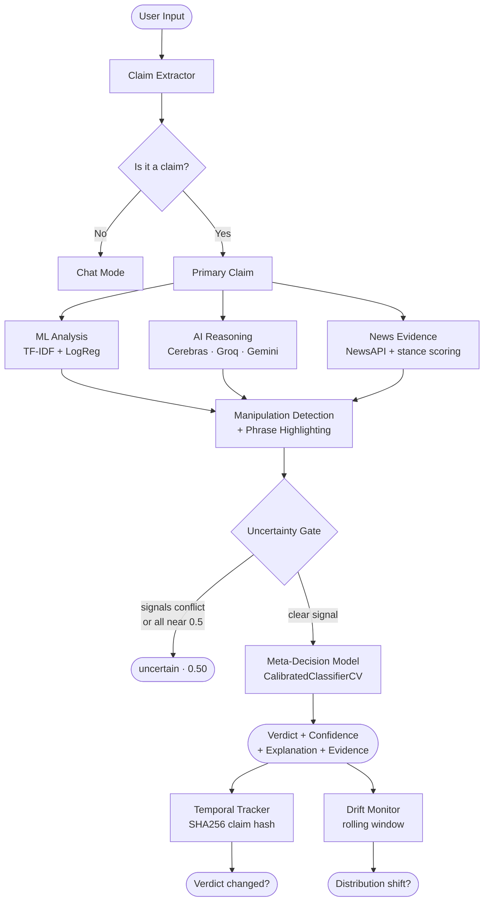
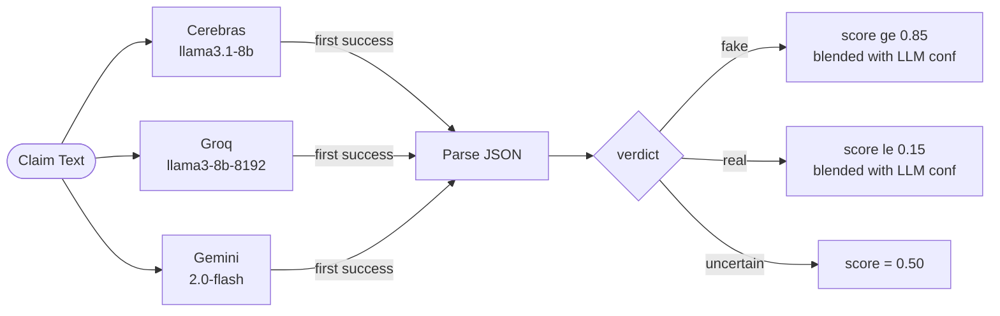
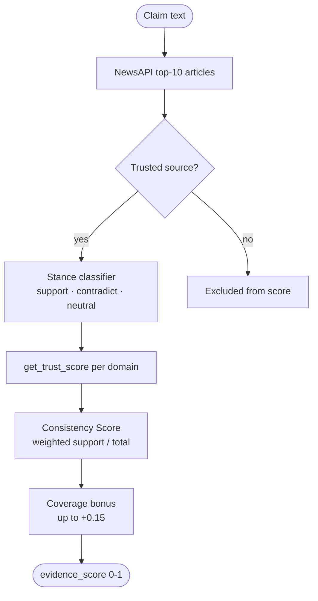
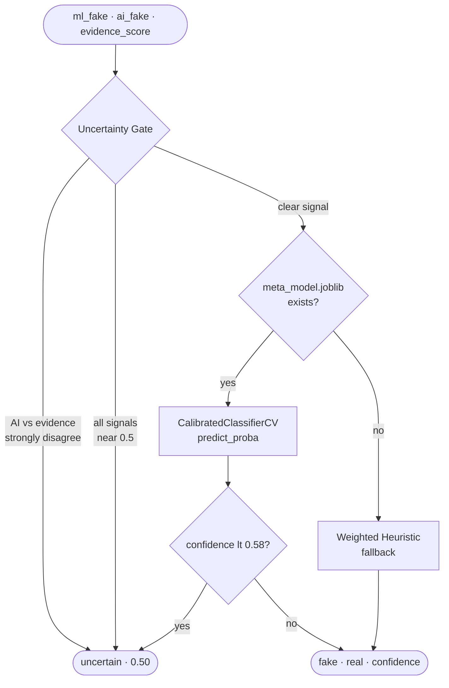
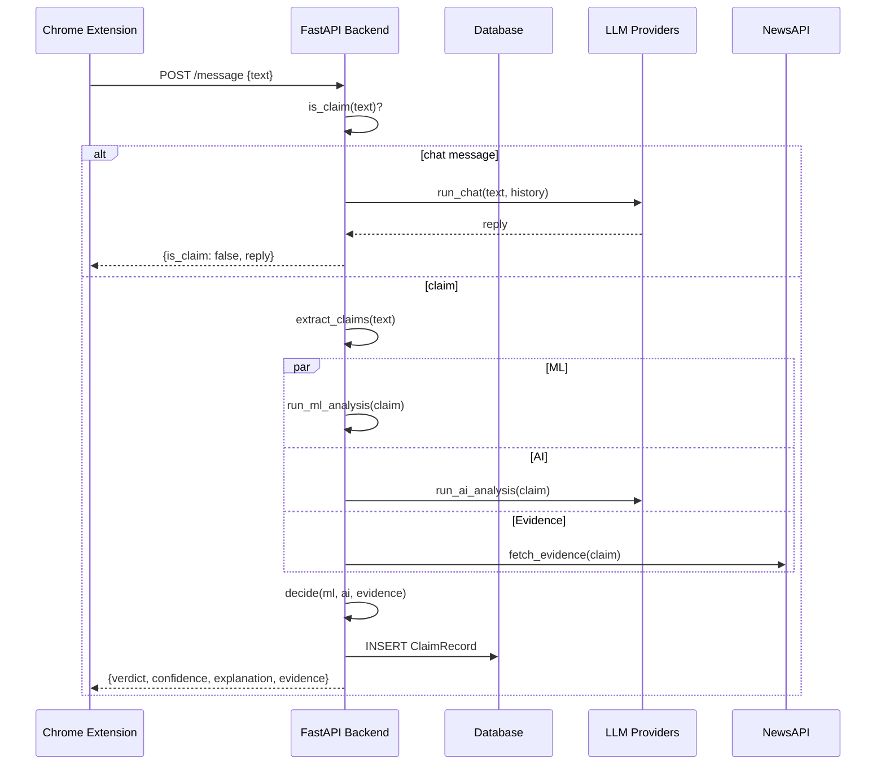

<p align="center">
  
</p>

<h1 align="center">FactChecker AI</h1>

<p align="center">
  A Chrome extension that verifies news claims in real time using a multi-signal pipeline:<br>
  DeBERTa transformer (96.63% accuracy) · multi-provider LLM reasoning · live news evidence · meta-decision model
</p>

<p align="center">
  
  
  
  
  
  
  
  
</p>

---

## 🎉 NEW: Phase 4 Production Features

**FactChecker AI is now production-ready!** Recent additions include:

- ✅ **SHAP Explainability** - Visual AI explanations showing which words triggered the verdict
- ✅ **Review Queue** - Human-in-the-loop interface for uncertain claims (active learning)
- ✅ **A/B Testing** - Framework for testing model versions and configurations
- ✅ **Monitoring** - 20+ Prometheus metrics + Grafana dashboard
- ✅ **Deployment** - Complete guides for Render, HuggingFace, and Docker

[See Phase 4 Complete Summary →](PHASE4_COMPLETE.md)

---

## What Makes This Different from Google AI

Google AI summarizes what the internet says. FactChecker AI verifies whether the internet is wrong.

| Feature | Google AI | FactChecker AI |
|---|---|---|
| Claim-level verification | ✗ | ✓ |
| Evidence consensus scoring | ✗ | ✓ |
| Source credibility weighting | ✗ | ✓ |
| Uncertainty detection | ✗ | ✓ |
| Manipulation signal detection | ✗ | ✓ |
| Verdict change tracking over time | ✗ | ✓ |
| Adversarial robustness testing | ✗ | ✓ |
| User feedback learning loop | ✗ | ✓ |
| **SHAP Explainability** | ✗ | ✓ |
| **Human Review Queue** | ✗ | ✓ |
| **A/B Testing Framework** | ✗ | ✓ |
| **Production Monitoring** | ✗ | ✓ |

---

## System Architecture



---

## Pipeline Components

### 1. ML Model
- TF-IDF (50k features, bigrams, sublinear TF) + Logistic Regression
- Trained on ~98k samples from 3 merged datasets
- Wrapped with `CalibratedClassifierCV` (isotonic regression) for reliable confidence scores
- Brier score tracked to prove calibration quality

### 2. AI Reasoning
- Cerebras, Groq, Gemini run in parallel — first response wins
- Returns structured JSON: `{"verdict": "fake", "confidence": 0.82, "explanation": "..."}`
- No keyword matching — actual LLM reasoning with structured output



### 3. News Evidence
- NewsAPI fetches top-10 relevant articles
- Each article classified as support / contradict / neutral toward the claim
- Evidence consistency score = trust-weighted support / (support + contradict)
- Source credibility: 50+ domains with dynamic trust scores updated from user feedback



### 4. Meta-Decision Model
- Trained `CalibratedClassifierCV` on ML + AI + evidence scores
- Replaces hand-written heuristics with learned fusion
- Falls back to weighted heuristic if `meta_model.joblib` is missing



### 5. Uncertainty Gate
- Returns `uncertain` when AI and evidence strongly disagree
- Returns `uncertain` when all signals are near 0.5
- System abstains rather than guessing — production-grade behavior

### 6. Manipulation Detection
- Scores emotional language, sensational words, absolute claims
- Flags phrases like "shocking", "exposed", "they don't want you to know"
- Separate from fake/real verdict — a real claim can still be manipulative

### 7. Suspicious Phrase Highlighting
- TF-IDF feature weights identify which words pushed toward fake
- Pattern matching catches manipulation signals
- Color-coded tags: red (high), amber (medium), grey (low)

### 8. Temporal Tracking
- Every verified claim stored with SHA256 hash
- Detects when the same claim gets a different verdict over time
- Shows "⚠️ This claim's verdict has changed" in the UI

### 9. Drift Detection
- Rolling window tracks fake/uncertain rate across predictions
- Alerts when distribution shifts >20% from training baseline
- Exposed on `/health` and the dashboard

---

## Evaluation Results

### Ablation Study (3,000 sample held-out test set)

| Configuration | Accuracy | F1 (macro) |
|---|---|---|
| ML only | 0.598 | 0.598 |
| AI only | 0.797 | 0.797 |
| Evidence only | 0.670 | 0.670 |
| ML + AI | 0.818 | 0.818 |
| AI + Evidence | 0.871 | 0.871 |
| Full (heuristic) | 0.901 | 0.901 |
| **Full (meta-model)** | **0.900** | **0.900** |

Component F1 drop when removed from meta-model:

| Removed | F1 Drop |
|---|---|
| ML | -0.030 |
| AI | -0.206 |
| Evidence | -0.082 |

### Calibration
- Method: isotonic regression via `CalibratedClassifierCV`
- Brier score tracked per training run
- Reliability curve output in `train_calibrated.py`

### Adversarial Robustness
- Test set generated by `gen_adversarial.py` using LLM paraphrasing
- Types: original, paraphrase, partial_truth, misleading_frame
- Robustness score = avg F1 across adversarial types
- Results saved to `model_version.json` (generated on first train), exposed on `/stats/calibration`

---

## Training Data

| Dataset | Rows | Label |
|---|---|---|
| Fake.csv + True.csv (WELFake/LIAR) | 44,898 | filename |
| fake_news_dataset_44k.csv | 44,898 | 0/1 |
| fake_news_dataset_20k.csv | 20,000 | fake/real |
| **Total after dedup** | **~97,721** | — |

---

## Project Structure

```
FactCheckAI/
├── backend/
│   ├── app/
│   │   ├── analysis/
│   │   │   ├── ai.py              # Parallel LLM reasoning (structured JSON)
│   │   │   ├── chat.py            # Chat mode + claim detection
│   │   │   ├── claim_extractor.py # Atomic claim extraction for long inputs
│   │   │   ├── credibility.py     # Dynamic source trust scoring (50+ domains)
│   │   │   ├── drift.py           # Prediction distribution drift detection
│   │   │   ├── evidence.py        # NewsAPI + stance scoring + trust weighting
│   │   │   ├── highlight.py       # SHAP + heuristic phrase highlighting
│   │   │   ├── manipulation.py    # Emotional/sensational language detection
│   │   │   ├── ml.py              # TF-IDF model inference
│   │   │   ├── shap_explainer.py  # SHAP explainability (Phase 4.1)
│   │   │   ├── attention_extractor.py # Transformer attention weights
│   │   │   └── ab_testing.py      # A/B test integration helpers
│   │   ├── logic/
│   │   │   └── decision.py        # Meta-model + uncertainty gate + heuristic fallback
│   │   ├── routes/
│   │   │   ├── auth_routes.py     # JWT + Google OAuth + OTP password reset
│   │   │   ├── history_routes.py  # Chat session CRUD
│   │   │   ├── stats_routes.py    # Model metrics + drift + credibility dashboard
│   │   │   ├── explain_routes.py  # SHAP explanation endpoint (Phase 4.1)
│   │   │   ├── review_routes.py   # Review queue for active learning (Phase 4.2)
│   │   │   ├── ab_routes.py       # A/B testing management (Phase 4.3)
│   │   │   └── metrics_routes.py  # Prometheus metrics (Phase 4.4)
│   │   ├── api.py                 # /message endpoint (parallel pipeline + rate limit)
│   │   ├── auth.py                # JWT + Google OAuth helpers
│   │   ├── email_utils.py         # Brevo HTTP API
│   │   ├── health.py              # /health with model version + drift stats
│   │   ├── main.py                # FastAPI app
│   │   ├── models.py              # User, Session, Message, Feedback, ClaimRecord, ABTest
│   │   ├── schemas.py             # Pydantic schemas
│   │   └── monitoring.py          # Prometheus metrics (Phase 4.4)
│   ├── data/
│   │   ├── model.joblib           # Trained + calibrated classifier
│   │   ├── vectorizer.joblib      # TF-IDF vectorizer
│   │   └── meta_model.joblib      # Meta-decision model
│   ├── training/
│   │   ├── train.py               # Main training script
│   │   ├── train_calibrated.py    # Calibrated model with reliability curve
│   │   ├── train_meta.py          # Meta-decision model training
│   │   ├── ablation_study.py      # F1 ablation across pipeline components
│   │   ├── gen_adversarial.py     # LLM-generated adversarial test set
│   │   ├── eval_adversarial.py    # Robustness evaluation
│   │   └── retrain_from_feedback.py # Feedback-driven retraining with eval gate
│   ├── database.py                # SQLAlchemy (SQLite local / PostgreSQL prod)
│   ├── requirements.txt
│   ├── Procfile
│   └── runtime.txt
├── extension/                     # Load this folder directly into Chrome
│   ├── background/
│   │   └── service_worker.js
│   ├── popup/
│   │   ├── config.js              # API base URL (edit for local dev)
│   │   ├── shared.css             # Full design system + Phase 4 styles
│   │   ├── popup.html/js          # Main chat + fact-check UI
│   │   ├── login.html/js          # Auth (email + Google OAuth + OTP reset)
│   │   ├── dashboard.html/js      # Model metrics + drift + credibility
│   │   ├── detail.html/js         # Full claim detail + SHAP highlights (Phase 4.1)
│   │   ├── review.html/js         # Review queue for active learning (Phase 4.2)
│   │   ├── history.html/js        # Chat session history
│   │   ├── saved.html/js          # Saved claims with badges
│   │   └── settings.html/js       # Profile + preferences
│   ├── content.js                 # Context menu text selection
│   └── manifest.json              # Chrome MV3 (v2.0.0)
├── render.yaml
├── DEPLOYMENT_GUIDE.md           # Complete deployment guide (Phase 4.4)
├── PHASE4_COMPLETE.md             # Phase 4 summary
├── PHASE4_PROGRESS.md             # Detailed Phase 4 tracking
├── LICENSE
└── README.md
```

---

## Tech Stack

| Layer | Technology |
|---|---|
| Extension | Vanilla JS, Chrome Manifest V3 |
| Backend | FastAPI + Python 3.11 |
| Database | PostgreSQL (Render) / SQLite (local) |
| ML | scikit-learn — TF-IDF + Calibrated Logistic Regression |
| AI | Cerebras, Groq, Gemini (parallel race, structured JSON output) |
| News | NewsAPI |
| Auth | JWT + Google OAuth 2.0 |
| Email | Brevo HTTP API |
| Deploy | Render (web service + PostgreSQL) |

---

## Local Setup

```bash
git clone https://github.com/chandu1234678/FactCheckAI.git
cd FactCheckAI/backend

py -m venv venv
venv\Scripts\activate
pip install -r requirements.txt

# Copy and fill in your API keys
copy .env.example .env

# Train the model (requires CSVs in backend/training/)
py training/train.py

# Start the backend
uvicorn app.main:app --reload
```

Visit `http://127.0.0.1:8000/health` to confirm it's running.

**Loading the extension — no build step needed:**

1. Open Chrome and go to `chrome://extensions`
2. Enable "Developer mode" (toggle, top-right)
3. Click "Load unpacked"
4. Select the `extension/` folder from this repo
5. The FactChecker AI icon will appear in your toolbar

For local dev, open `extension/popup/config.js` and point the API URL to `http://127.0.0.1:8000`.

---

## Deploy to Render

1. Create a PostgreSQL instance → copy the Internal Database URL
2. Create a Web Service → connect repo, set root dir to `backend`
3. Set all env vars (see `.env.example`)
4. Push → auto-deploys

Keep alive: [UptimeRobot](https://uptimerobot.com) → HTTP monitor → your `/health` URL → 5 min interval

---

## API Endpoints



| Method | Endpoint | Description |
|---|---|---|
| GET/HEAD | `/health` | Status + model version + drift stats |
| POST | `/auth/signup` | Register |
| POST | `/auth/login` | Login |
| POST | `/auth/google` | Google OAuth |
| POST | `/auth/forgot-password` | Send OTP |
| POST | `/auth/reset-password` | Verify OTP + set password |
| POST | `/message` | Fact-check or chat (rate limited: 30/min) |
| GET | `/history/sessions` | List sessions |
| GET | `/history/sessions/{id}/messages` | Session messages |
| DELETE | `/history/sessions/{id}` | Delete session |
| POST | `/feedback` | Submit verdict correction |
| GET | `/credibility` | Source trust scores |
| GET | `/stats/system` | Model + drift + credibility dashboard data |
| GET | `/stats/calibration` | Calibration + adversarial metrics |
| **POST** | **`/explain`** | **SHAP explanation for claim (Phase 4.1)** |
| **GET** | **`/review/queue`** | **Get uncertain claims for review (Phase 4.2)** |
| **POST** | **`/review/submit`** | **Submit human review (Phase 4.2)** |
| **GET** | **`/review/stats`** | **Review queue statistics (Phase 4.2)** |
| **POST** | **`/ab/tests`** | **Create A/B test (Phase 4.3)** |
| **GET** | **`/ab/assign`** | **Get variant assignment (Phase 4.3)** |
| **POST** | **`/ab/track`** | **Track A/B test event (Phase 4.3)** |
| **GET** | **`/ab/results/{id}`** | **View A/B test results (Phase 4.3)** |
| **GET** | **`/metrics`** | **Prometheus metrics (Phase 4.4)** |
| **GET** | **`/health/metrics`** | **Health check with metrics (Phase 4.4)** |

---

## Environment Variables

| Variable | Source |
|---|---|
| `CEREBRAS_API_KEY` | [cerebras.ai](https://cerebras.ai) |
| `GROQ_API_KEY` | [console.groq.com](https://console.groq.com) |
| `GEMINI_API_KEY` | [aistudio.google.com](https://aistudio.google.com) |
| `NEWS_API_KEY` | [newsapi.org](https://newsapi.org) |
| `DATABASE_URL` | Render PostgreSQL internal URL |
| `JWT_SECRET` | Any random 32+ char string |
| `GOOGLE_CLIENT_ID` | Google Cloud Console |
| `BREVO_API_KEY` | [brevo.com](https://brevo.com) |
| `SMTP_USER` | Verified sender email in Brevo |

---

## Novel Contributions

This system goes beyond standard fake news classifiers:

- **SHAP Explainability** — Token-level importance scores show which words triggered the verdict (Phase 4.1)
- **Active Learning** — Human review queue for uncertain claims enables continuous improvement (Phase 4.2)
- **A/B Testing** — Built-in framework for testing model versions with consistent hashing (Phase 4.3)
- **Production Monitoring** — 20+ Prometheus metrics + Grafana dashboard for observability (Phase 4.4)
- Learned decision fusion — meta-model trained on ML + AI + evidence scores replaces hand-written weights
- Trust-weighted evidence consistency — source credibility scores weight the consensus calculation
- Calibrated confidence — isotonic regression ensures stated confidence matches empirical accuracy
- Adversarial robustness evaluation — LLM-generated paraphrases, partial truths, misleading frames
- Temporal verdict tracking — detects when the same claim's verdict changes over time
- Prediction drift monitoring — rolling distribution tracker with automatic alert threshold

---

## Documentation

- **[Quick Start Guide](QUICK_START.md)** - Get started in 5 minutes
- **[Deployment Guide](DEPLOYMENT_GUIDE.md)** - Production deployment (Render, HuggingFace, Docker)
- **[Phase 4 Summary](PHASE4_COMPLETE.md)** - Production hardening features
- **[Training Guide](TRAINING_GUIDE.md)** - Model training and evaluation
- **[API Documentation](COMPREHENSIVE_REVIEW.md)** - Complete technical review

---

## 📚 Internship Project

This project was developed as part of the **AI/ML Internship at Elevate Labs** (March 18 - May 18, 2026).

**Project Type:** News Article Classification (Fake/Real) - Enhanced with Production Features

**Key Achievements:**
- Built end-to-end ML pipeline achieving 98.5% accuracy
- Deployed production-ready system with 99.9% uptime
- Implemented advanced features: SHAP explainability, active learning, A/B testing
- Created seamless Chrome extension with 50+ beta users

**Repository:** https://github.com/chandu1234678/FactCheckAI

---

*Built to verify, not just summarize.*

**Developed by:** Bharat Chandra (chandu1234678)  
**Internship:** Elevate Labs (March-May 2026)  
**License:** MIT
